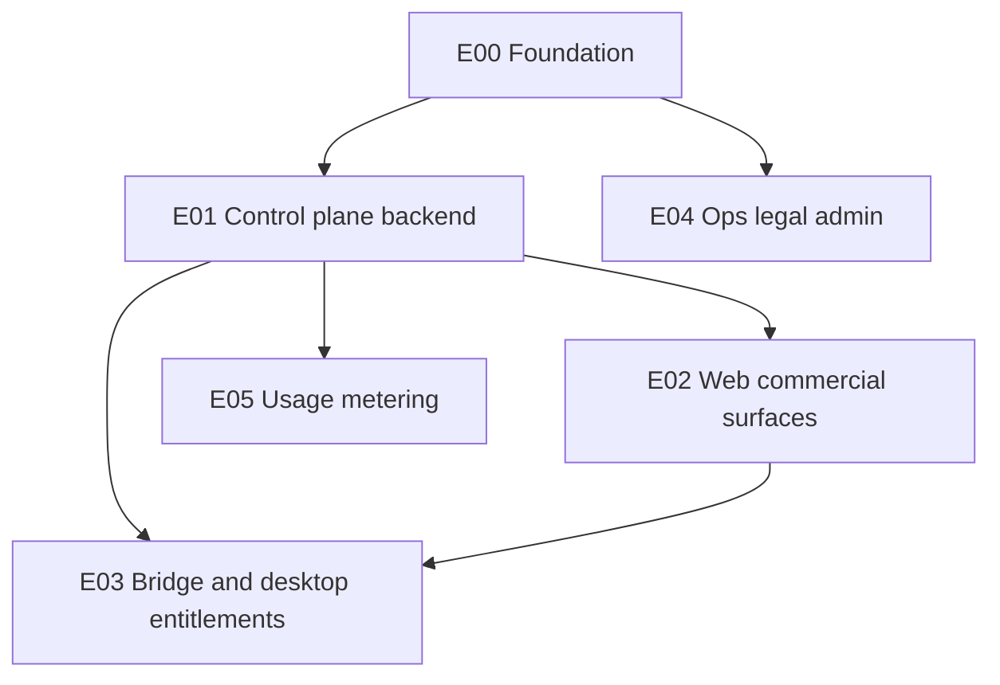

# Commercialisation — implementation plan

**Document status:** Draft v0.1  
**Date:** 20 May 2026  
**Companion:** [`PRD.md`](PRD.md) · Epic detail: [`epics/README.md`](epics/README.md)

This plan decomposes the commercialisation PRD into **epics**, **stories**, and **sequencing** across the existing monorepo. It assumes **test-driven delivery** for billing, webhooks, and entitlement logic (red → green → refactor before merge).

---

## 1. Executive summary

**Today:** `packages/web` + `packages/bridge` + `apps/dev-bridge` + `apps/desktop-macos` (+ `packages/llm`, `packages/indexer`). No production multi-tenant backend or billing.

**Target:** A small **control plane** (new deployable) plus **web commercial surfaces** and **bridge/desktop entitlement awareness**, so paid users can sign in, subscribe or buy lifetime BYOK, and receive enforceable feature entitlements without exfiltrating API keys.

**Suggested new workspace root:** `apps/control-plane` (name TBD) — HTTP API + worker for webhooks, owned by the same pnpm workspace. Alternative: external BaaS with minimal custom glue; the epics still apply, but story ownership shifts to configuration and thin custom endpoints.

---

## 2. Phases and epic mapping

| Phase | Weeks (guide) | Goal | Epics (primary) |
|-------|----------------|------|------------------|
| **C0** | 2–3 | Decisions, schema, environments | E00 |
| **C1** | 4–6 | Auth + subscription + entitlements + web paywall | E00, E01, E02, E04 (minimal), E03 (skeleton) |
| **C2** | 3–5 | Lifetime SKU, grace/cancel hardening, admin | E01, E02, E03, E04 |
| **C3** | 4–6 (optional) | Hosted AI usage metering and caps | E05, E01 |

---

## 3. Dependency graph (logical order)

- **E01 before E02** for real checkout and session-bound entitlement tokens (E02 can stub against mocks until E01 exists).
- **E03** depends on a stable entitlement contract from **E01** and UI/session from **E02**.

---

## 4. Repository and package touchpoints

| Area | Path | C1 role | Notes |
|------|------|---------|--------|
| Web UI | `packages/web` | Pricing, auth UI, account, paywall, “sign in required” states | Vite env for control-plane base URL |
| Shared bridge types | `packages/bridge` | Optional: entitlement client types, host capability flags | Keep provider-agnostic |
| Dev bridge | `apps/dev-bridge` | Dev-only: validate entitlement refresh flow against staging API | Parity with Tauri for local testing |
| Desktop | `apps/desktop-macos` | Keychain + entitlement refresh; menu/help links | Same contract as dev-bridge |
| LLM | `packages/llm` | BYOK unchanged; **C3** adds metering hooks if hosted inference | No keys in web bundle |
| New service | `apps/control-plane` (proposed) | Auth callbacks, Stripe webhooks, DB, entitlement issuance | Deploy separately from static web |

---

## 5. Story index (backlog)

Stories are grouped by epic; full text lives under [`epics/`](epics/).

| ID | Epic | Title | Phase |
|----|------|-------|-------|
| COM-001 | E00 | Lock commercial model and plan SKUs | C0 |
| COM-002 | E00 | Select auth and billing vendors; document ROPA/DPA needs | C0 |
| COM-003 | E00 | Define entitlement JSON schema + versioning | C0 |
| COM-004 | E00 | Provision dev/staging/prod + secrets store | C0 |
| COM-101 | E01 | Bootstrap control-plane app and health checks | C1 |
| COM-102 | E01 | User identity mapping (auth subject → internal user id) | C1 |
| COM-103 | E01 | Stripe products/prices and checkout session creation | C1 |
| COM-104 | E01 | Webhook endpoint: idempotent subscription lifecycle | C1 |
| COM-105 | E01 | Entitlement read API + signed short-lived token for bridge | C1 |
| COM-106 | E01 | Database migrations and backup strategy | C1 |
| COM-201 | E02 | Marketing layout: landing, pricing, legal footer | C1 |
| COM-202 | E02 | Sign-in/up flows wired to auth vendor | C1 |
| COM-203 | E02 | Post-checkout success and entitlement polling | C1 |
| COM-204 | E02 | In-app account and “manage billing” deep link | C1 |
| COM-205 | E02 | Feature gates for paid-only surfaces (config-driven) | C1 |
| COM-301 | E03 | Bridge: fetch and cache entitlements; refresh on interval | C1 |
| COM-302 | E03 | Offline grace window and UX copy | C2 |
| COM-303 | E03 | Desktop parity with dev-bridge entitlement path | C1 |
| COM-401 | E04 | Production web hosting + custom domain + TLS | C1 |
| COM-402 | E04 | Observability: structured logs, metrics, alerts | C1 |
| COM-403 | E04 | Publish privacy, terms, cookie, acceptable use | C1 |
| COM-404 | E04 | Admin/support: account lookup and manual entitlement fix | C2 |
| COM-405 | E04 | Status page and incident comms template | C2 |
| COM-501 | E05 | Usage event ingestion API (signed server-side only) | C3 |
| COM-502 | E05 | Quota evaluation and user dashboard | C3 |
| COM-503 | E05 | Abuse limits and reconciliation job | C3 |

---

## 6. Sequencing checklist (week-by-week sketch)

Use as a planning spine; adjust after vendor picks.

### C0 (weeks 1–3)

1. COM-001 → COM-002 → COM-003 in parallel with COM-004 (infra).
2. Exit criteria: schema reviewed, staging URL exists, secrets not in repo.

### C1 (weeks 4–9)

1. COM-101, COM-106 (skeleton + DB).
2. COM-102, COM-103, COM-104 (identity + billing + webhooks) — **tests first** for state machine and webhook idempotency.
3. COM-105 (entitlement API) — contract tests consumed by web and bridge.
4. COM-201–COM-205 (web) in parallel once COM-105 is stub-stable.
5. COM-301, COM-303 (bridge/desktop) — integration tests against staging.
6. COM-401–COM-403 before private beta invites.

### C2 (weeks 10–14)

1. Lifetime SKU and COM-104 extensions; COM-302; COM-404–COM-405.

### C3 (optional)

1. COM-501–COM-503 after hosted inference path is productised.

---

## 7. TDD quality gates (mandatory)

| Layer | What to test first | Examples |
|-------|-------------------|----------|
| Control plane | Pure billing state transitions | `active` → `past_due` → `canceled` and entitlement effects |
| Webhooks | Raw payload fixtures + signature verification | Reject replay; duplicate event idempotent |
| Entitlements | Resolver: plan + add-ons + expiry + lifetime flag | Table-driven unit tests |
| Bridge | HTTP client against mocked control plane | Cache TTL, clock skew, 401 handling |
| E2E (staging) | Single smoke journey | Signup → checkout test mode → gated feature unlock |

**Rule of thumb:** no story that changes money or access rules merges without new or updated automated tests at the lowest practical layer.

---

## 8. Open engineering decisions

1. **Control-plane stack:** Node (Fastify/Hono) vs serverless functions — team familiarity and webhook latency drive this.
2. **Auth:** fully managed (Clerk/Auth0) vs self-hosted — support burden vs cost.
3. **Entitlement transport to bridge:** opaque signed JWT vs opaque server-side session + bridge poll — pick one and version it (`COM-003`).
4. **Desktop distribution:** Mac App Store vs direct download affects billing (IAP rules) and must be decided before marketing promises.

---

## 9. How to use this with issue trackers

- Create a milestone per phase (**C0**, **C1**, …).
- One issue per **COM-** story; label with **E00–E05**.
- Link PRs to issues; keep epic files updated when scope changes (short changelog section at bottom of each epic file).

---

## Related

- [`PRD.md`](PRD.md)  
- [`epics/README.md`](epics/README.md)
